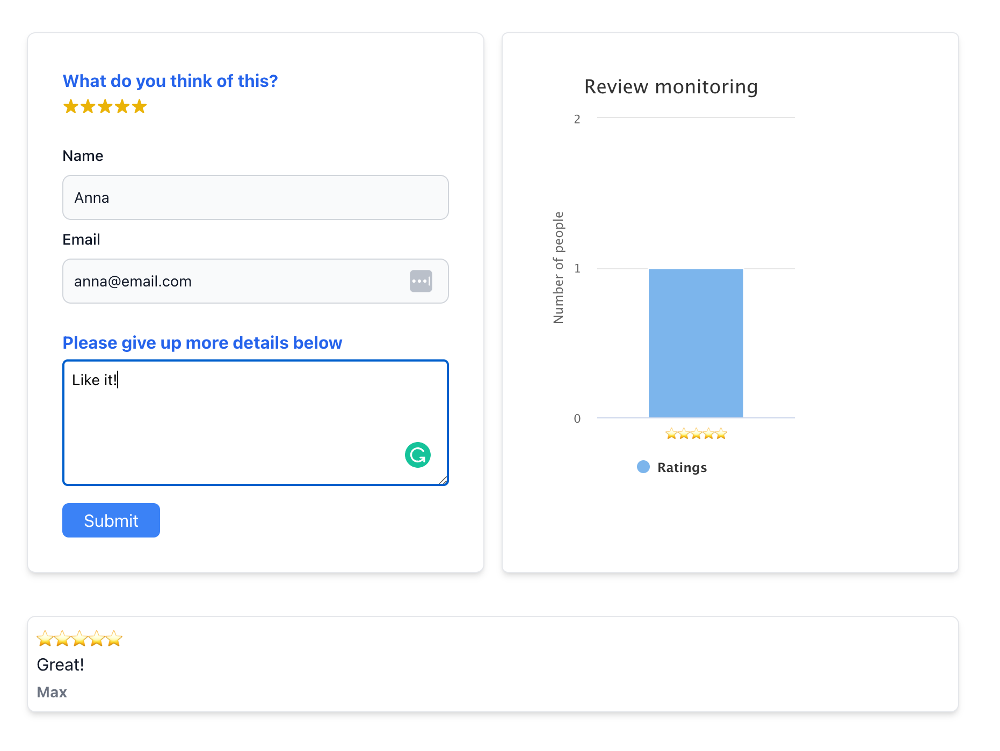

# FEEDBACK PAGE

SPA React application to submit a page feedback form. Once a review is submitted a user can see the statistics graph displaying a number of reviews by its rating. As for validation, I used yup library that nicely works with formik state. Various errors are raised upon invalid data input preventing the form submission.

Technology used:

- React
- Typescript
- Tailwind
- Highcharts
- Formik
- Yup
- react-resting-library, jest

## How to run the application

Clone down this repository. You will need node and npm installed globally on your machine
In the project directory, you can run:

### `npm run install`

To install all the dependencies

### `npm run start`

Runs the app in the development mode.\
Open [http://localhost:3000](http://localhost:3000) to view it in the browser.

### `npm run test`

Launches the test runner in the interactive watch mode.

### `npm run build`

Builds the app for production to the `build` folder.\
It correctly bundles React in production mode and optimizes the build for the best performance.
